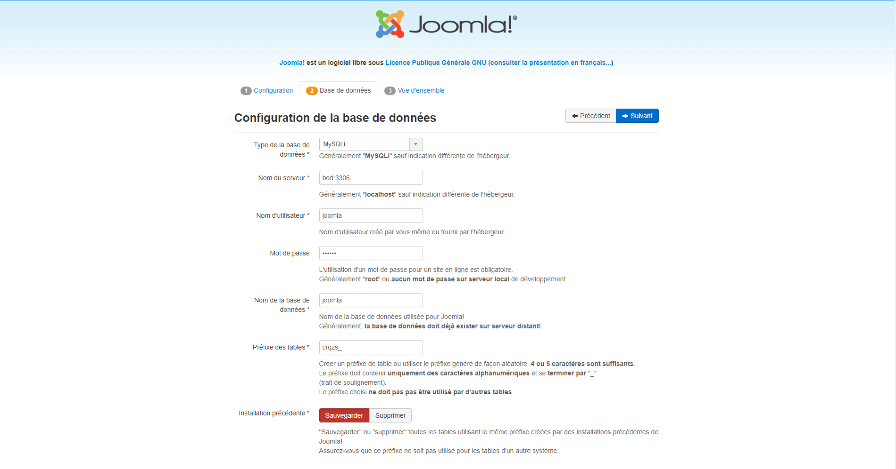
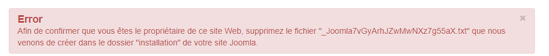

# TP DOCKER EVAL

This project consist to dockerise a full **[Joomla!](https://www.joomla.fr/)** installation

## List of things to do :
- [X] Configuration files in client directory
- [X] BDD storage in client directory
- [X] Use debian base iamge for joomla installation
- [X] [1/3] Create a joomla-logs folder where all the logs should be stored on client
- [X] use docker compose to make the process automatic
- [X] Use environement variables

## How to start
Just run `docker-compose up` and you should be good to go.
> ⚠️ Joomla decompression can take a good ammount of time I recomand you to download it yourself and extract it in the path you set in environment variable. more details below

# Informations

You should download **[Joomla!](https://www.joomla.fr/joomla/telecharger-joomla)** yourself and extract it in JOOMLA_BASE_DIR/JOOMLA_SRC_PATH.
You can skip this step as it is done automaticly (Joomla 3.9) at first container init but it takes a good ammount of time.

Most of the configuration can be changed in the **[.env](.env)** file. It is already documented via comments

The joomla application is by default availible on **localhost:8080** and mysql on port **localhost:8081**

When configuring joomla you have to use the url `bdd:3306` to connect the the mysql instance because joomla is in the docker network.

All the other informations about the database can also be configured in **[.env](.env)**.

By default database name/username/password are 'joomla'.

> ⚠️ When connecting for the first time Joomla might want to to delete a file that it has created in joomla installation folder use the  JOOMLA_BASE_DIR/JOOMLA_SRC_PATH/installation to find it and delete it then continue

Other than that just follow the step and you should be good to go !

# Note for my professor 😁

I was unable to make the log file of mysql working i've tired a good ammount of methods but none of them work.
My work is still present in the dockerfile.

And the log for joomla is contained in the installation path of joomla and i wasnt able to moun tthis particular folder in joomla-logs but it is present in joomla install path